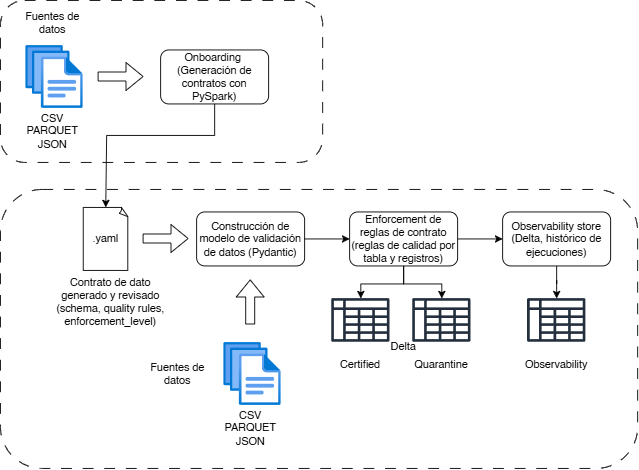

# TFM - Contratos de datos como regla arquitectónica base en pipelines de datos
### Alumno: Manuel Adolfo Gomez Ramos

#### Diagrama del flujo de trabajo


#### Estrctura de ficheros

```
Prototipo_TFM_DataContracts/
├── .venv/
├── contracts/
│   └── drafts/
│       ├── draft_contract_yellow_tripdata_2021-09.yaml
│       ├── draft_contract_yellow_tripdata_2021-09_enf_lvl_3.yaml
│       └── draft_contract_yellow_tripdata_2025-09.yaml
├── data/
│   ├── baseline_certified/
│   ├── certified/
│   ├── certified_2025-09/
│   ├── landing/
│   ├── observability/
│   ├── quarantine/
│   └── quarantine_2025-09/
├── src/
│   ├── enforcement.py
│   ├── onboarding.py
│   └── pipeline.py
├── .gitignore
├── contract_gen.py
├── main.py
├── README.md
└── requirements.txt
```

#### Repositorio de dataset público 
Enlace a los distintos datasets usados en el TFM:
- https://d37ci6vzurychx.cloudfront.net/trip-data/yellow_tripdata_2021-09.parquet

- https://d37ci6vzurychx.cloudfront.net/trip-data/yellow_tripdata_2023-09.parquet

- https://d37ci6vzurychx.cloudfront.net/trip-data/yellow_tripdata_2025-09.parquet